[multipage-level=1]
== Checklist assembly

Building a new checklist consists of several steps and tools, which are described below:

=== 3.1 Add a root taxon

To start the checklist assembly the highest taxonomic level  has to be established. Under the Alias of the project on the left menu select the  Assembly subitem, click on the Add root button near the middle of the window. 

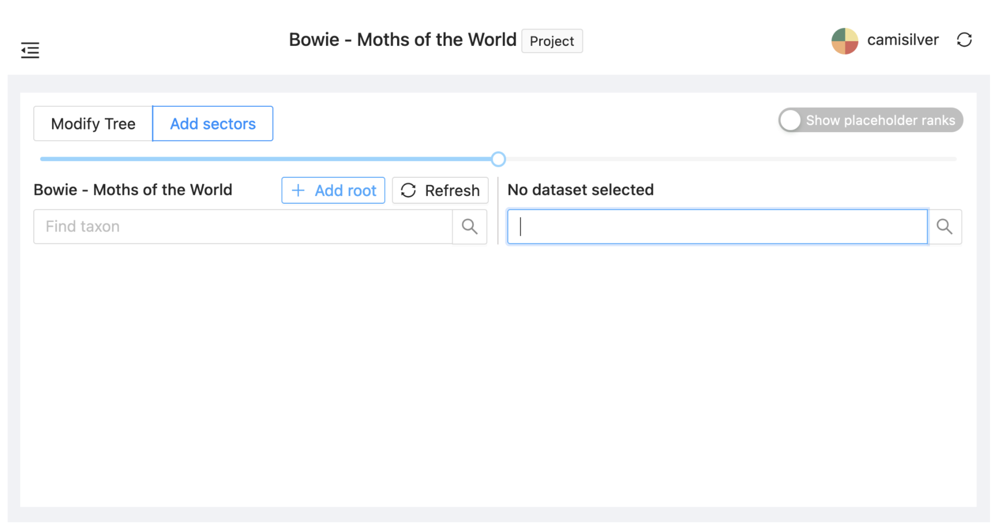

Enter the name “Lepidoptera” and click on Parse name. 

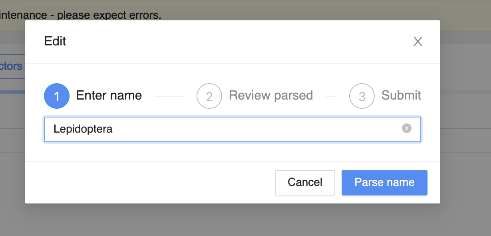

A form will appear, change the Rank to order. This will change the display to include the fields shown in the image. Complete these as follows:

- Name status: established
- Authorship: Linnaeus, 1758

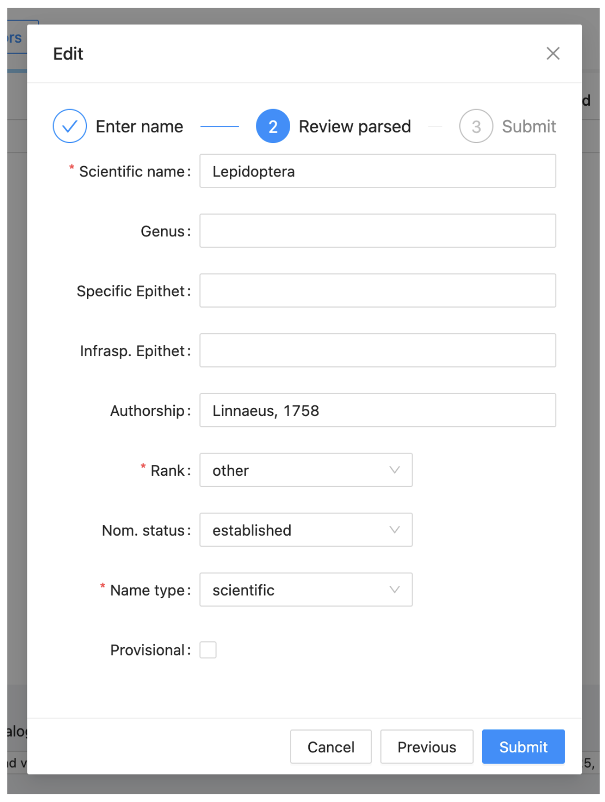

Then click on 'Submit'. 
The project now includes a single taxon (the order Lepidoptera) with a yellow triangle indicating that at present no sectors have been added. 

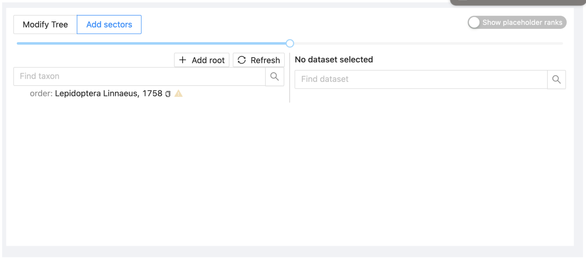

=== 3.2 Add and manage sectors

The building blocks for a ChecklistBank project are called  Sectors, these can be created by adding an entire dataset or a specific taxonomic group within a dataset. You can create as many sectors as needed, this gives maximum flexibility to assemble the project. There are several methods  to add sectors to the assembly:

- *Union*: add all the descendants of the subject taxon, and ignores the name of the subject itself
- *Attach*: adds the subject taxon and all its descendants
- *Merge*: enriches the existing assembly with additional information provided by the selected sector like, new names, synonyms, authorships, and references among others.

There are also several editorial decisions that can be made over any taxon on the project:

- *Block*: Ignores the selected name and its children.
- *Ignore*: Only the selected name is ignored.
- *Review*: Marks  that the selected name has already been reviewed and does not require changes.

==== 3.2.1 Union 

You will start by adding the base tree, GLI, as the first sector with the union method.  Make sure that the  Add sectors option is selected at the top of the window. 

On the search box on the right side of the window, enter “GLI” or  “Global Lepidoptera Index”. Alternatively, type “55434”, which is the dataset ID for GLI. Wait a couple of seconds for the drop down list of datasets to appear.

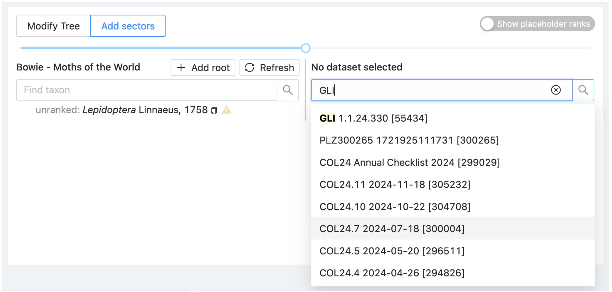

The right side of the window will refresh with the hierarchy for GLI. 

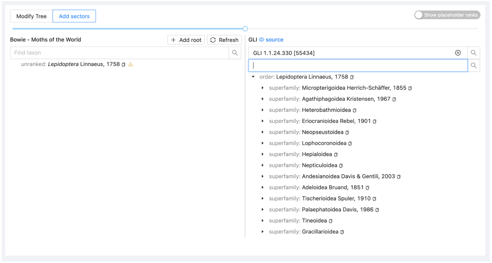

Select Lepidoptera on the right and drag it across onto or immediately below Lepidoptera on the left. You will be asked to specify how the GLI Lepidoptera should be added as a project sector. Select 'Union'. 

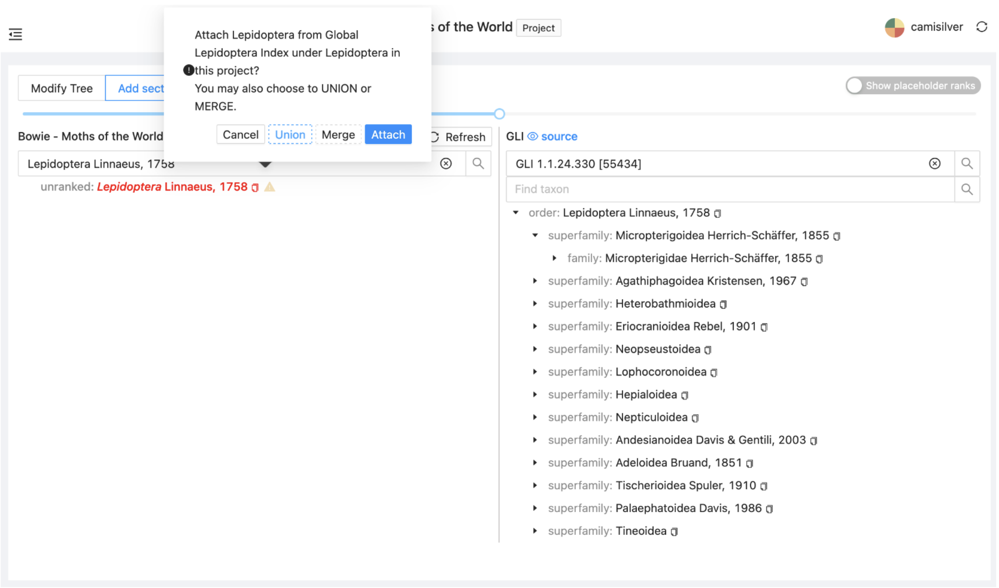

The left side of the window will refresh to show that Lepidoptera is now sourced from GLI and will list just the first five children of GLI as an indication of content. The coloured labels will allow GLI to be distinguished easily from other sectors as they are added. 

image::img/web/assembly_GLI_view.png[align=center,width=600]

==== 3.2.2 Block

Now you are going to add a decision to exclude some parts from GLI: the superfamily Papilionoidea, the superfamily Alucitoidea and the genus Phragmataecia. 
Click on the 'Source' item in the menu at the left of the ChecklistBank window. This will open a Select option with a second blue cog. Click on the cog.  

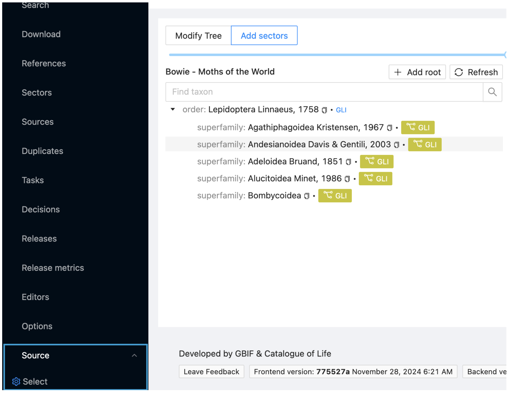

You only have one sector in your project (GLI). Select this from the pop up search window.

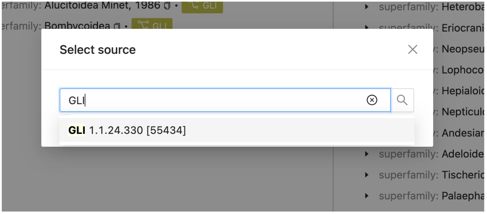

A new view of GLI will appear next to a blue cog. This shows us the active source dataset for workbench operations. As more sectors are added, clicking again on the cog will allow you to switch source dataset.  

The initial view shows the Issues known for the dataset. GLI is very large and still being actively curated, so there are many of these, but they can be ignored for this tutorial. 

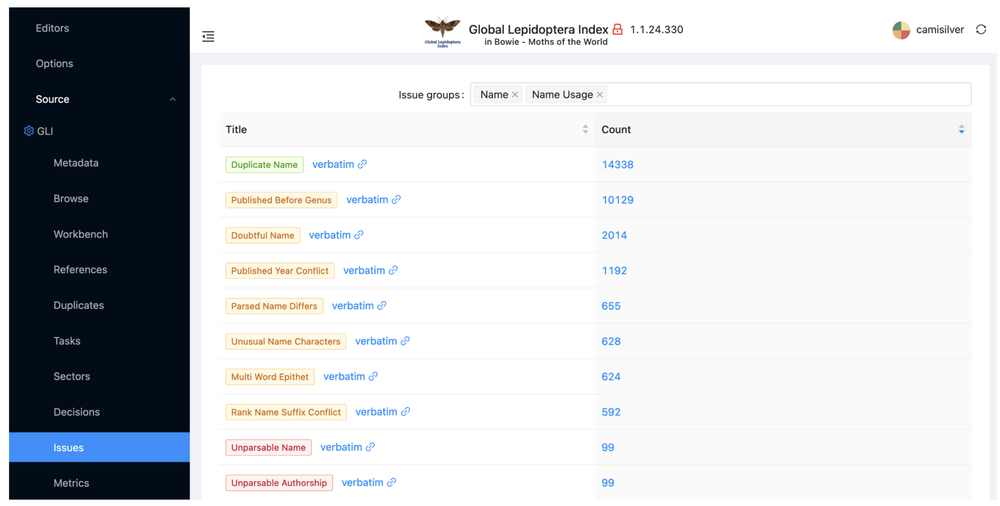

Select the 'Workbench´ subitem for the Source view of GLI. The workbench shows all of the taxa that will be included in your project dataset from GLI. 

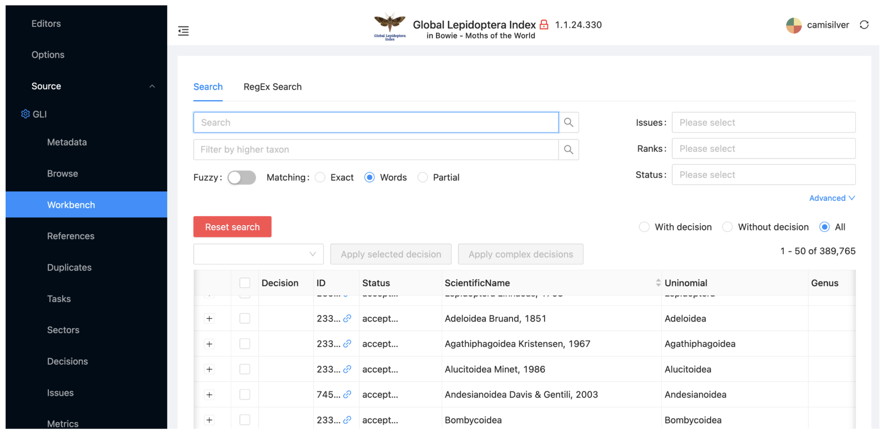

Type “Papilionoidea” in the Search box at the top of the window and hit Enter. The record for the butterfly superfamily Papilionoidea will be the only one shown. You can alternatively filter taxa using ranks or higher taxon or other options that can be selected by clicking on 'Advanced'. 

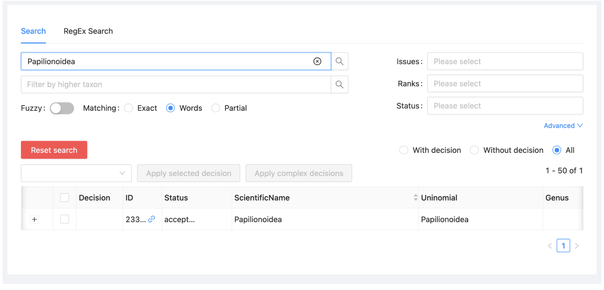

Select "Block" from the dropdown at the left above the taxon list (just below “Reset search”). 

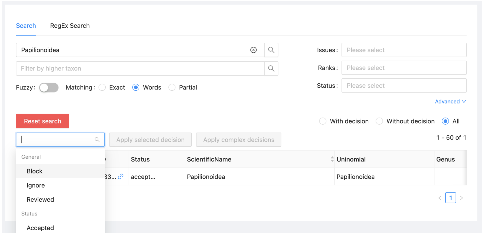

Select "Papilionoidea" from the list and click on 'Apply selected decision'.

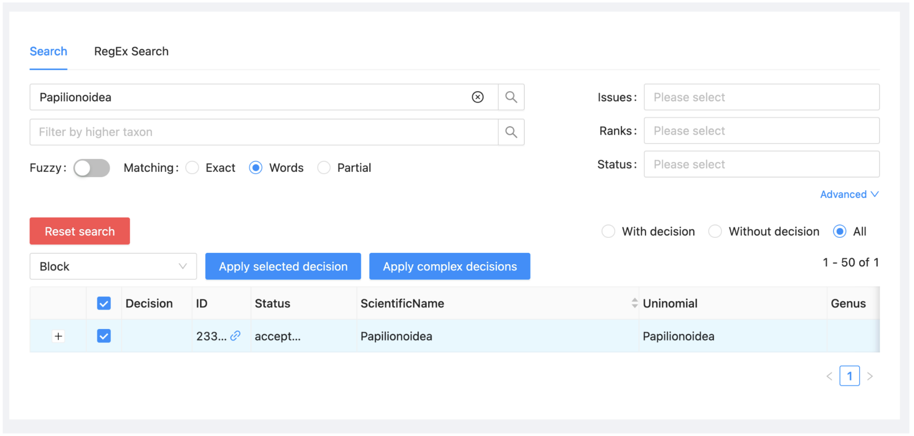

If you click now on ‘Reset search’ (the red button on the left) and the ‘With decision’ radio button on the right, you will see that you have now specified a single decision, that Papilionoidea should be blocked. The same information can also be seen if you click on the Decisions subitem under the project menu.

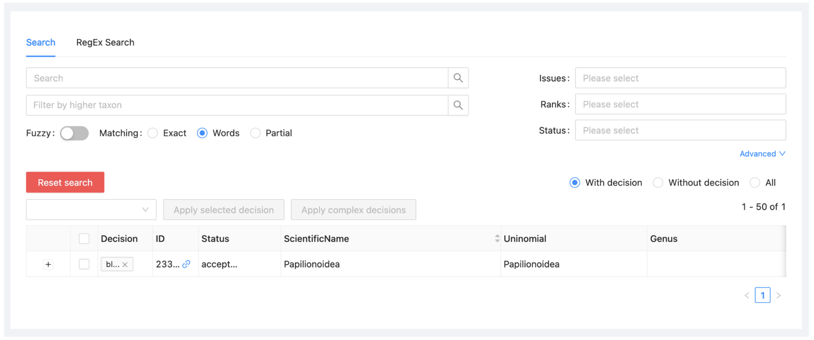

When you populate the dataset, this decision will be honoured. 

Repeat the same steps (Source: Global Lepidoptera Index > Workbench > search for taxon > Block taxon) for the superfamily Alucitoidea and the genus Phragmataecia. 

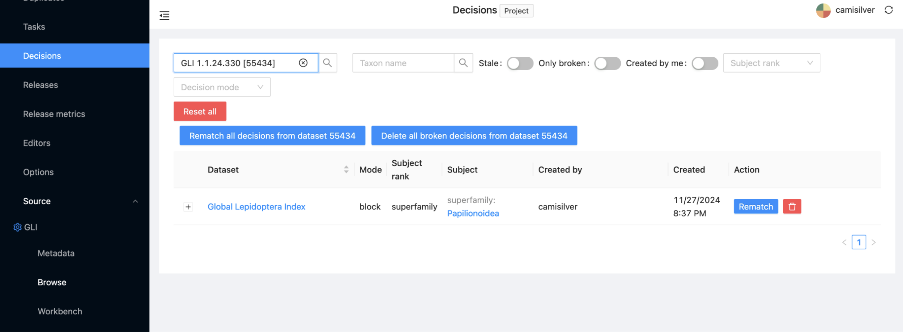

==== 3.2.3  Attach 

Unlike GLI, the dataset Catalogue of the Alucitoidea of the World (ALU) includes higher classification all the way up to the kingdom, thus you are going to replace  GLI Alucitoidea sector with ALU source. 

In the project, select the Assembly subitem at the left  and make sure the  Add sectors view is selected (at the top of the window). Enter “Alucitoidea” in the search field on the right, wait a couple of seconds for the drop down list of datasets to appear, and select the first dataset (id:2207). 

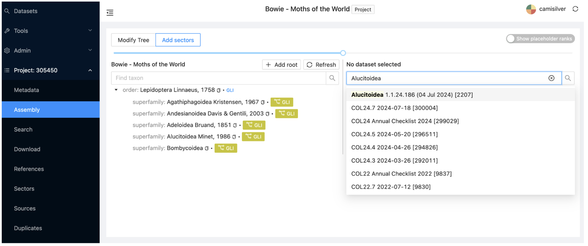
 
Select the small arrows next to each name until the superfamily Alucitoidea appears. Alternatively, type “Alucitoidea” in the second search box on the right of the window and select it directly.

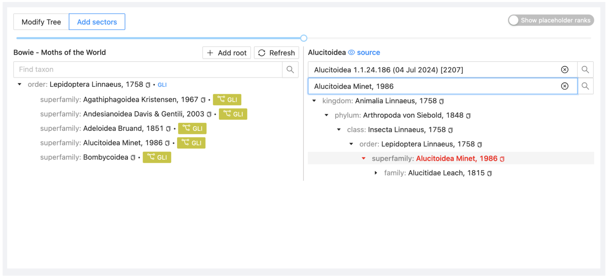

Drag Alucitoidea from ALU on the right onto Lepidoptera in your project on the left. Select Attach to include it as a child taxon. 

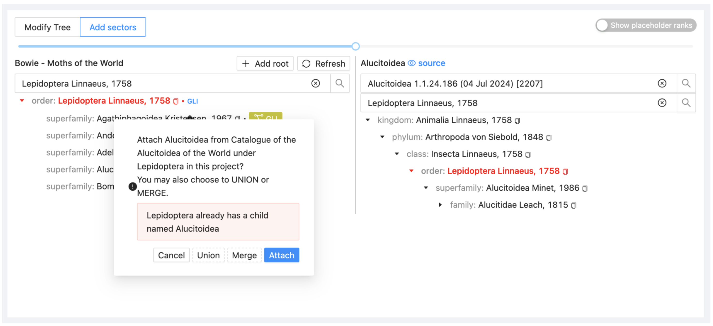

The project display will now show that you have added two sectors. Note also the blue eye symbol and source link at the top right. This is a quick way to select the current dataset as the current source dataset in the Source submenu. 

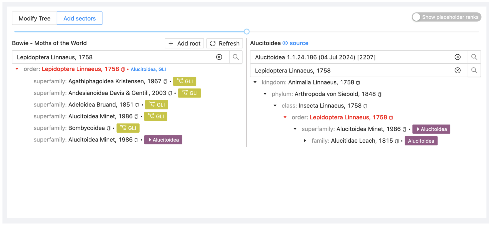

At this point the tool only shows an overview of the higher classification, to continue creating sectors at a more specific level it is best to synchronize all sectors so the entire assembly can be explored and managed.

Select the Sectors item in the menu at the left below the alias of your project. This view allows you to synchronise the content from each sector into your project. 

Select the 'Sync all sectors' button and click 'Yes'. 

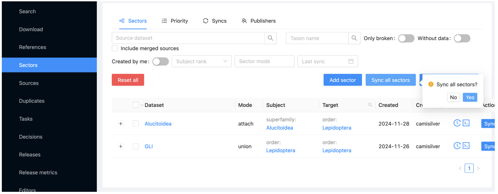

Return to the Assembly subitem. You will see the view of the project contents beginning to be updated. This will take several minutes, grab a cup of coffee and wait for it to complete. You can Refresh the display to see progress.  

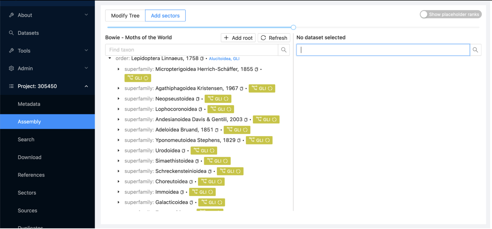

Alternatively, you may click on the double arrowed circle on the top right and see the Sync state. 

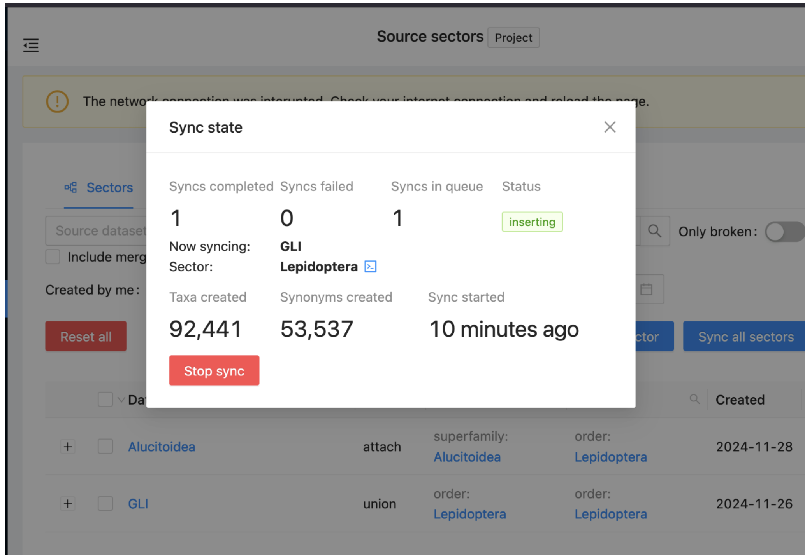

Now let's Attach a new sector.

In the Assembly > Add sectors view, search on the left side for the tribe Zeuzerini and on the right search for Phragmataecia and select dataset PLZ31420 (PHR). 

image::img/web/CLB-search.png[align=center,width=600]

Find the genus Phragmataecia from PHR and drag it onto Zeuzerini in the project. Select  Attach to insert the genus as a new sector. 

image::img/web/CLB-search.png[align=center,width=600]

A new sector (with a new colour) will appear on the left. The PHR (alias is PLZ31420). The sector has not yet been synchronised so it shows no child taxa. 

image::img/web/CLB-search.png[align=center,width=600]

==== 3.2.4 Merge

With this option to add sectors you can combine information from two or more sources. Here you will merge the species from GLI and those from the checklist derived from GAR, the paper “A review of the genus Gargela Walker in China…” (PLZ41041) that are not included in GLI.

Go again to the Assembly > Add sectors view, search on the left side for the genus Gargela and on the right search for Gargela and select the dataset PLZ41041 (GAR).  

Drag the genus Gargela from GAR onto the genus Gargela in the project view. Select Merge. It adds all taxa from the source dataset to the project if there is not already an entry for them. 
 
image::img/web/CLB-search.png[align=center,width=600]

Go to the Sectors view and select Sync for the two new sectors (Phragmataecia and Gargela). 

image::img/web/CLB-search.png[align=center,width=600]

Following the synchronisation, the additional taxa will appear in the project view under Assembly, you can identify the merged taxa by a yellow square with the letter “m”.

image::img/web/CLB-search.png[align=center,width=600]
