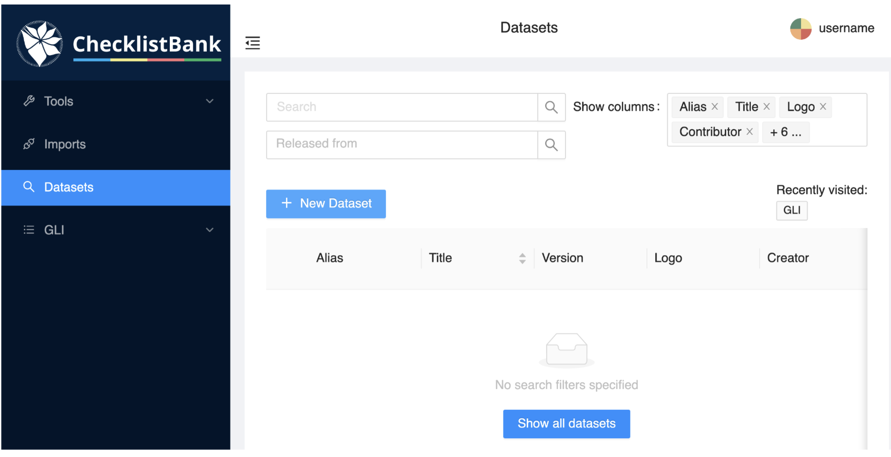
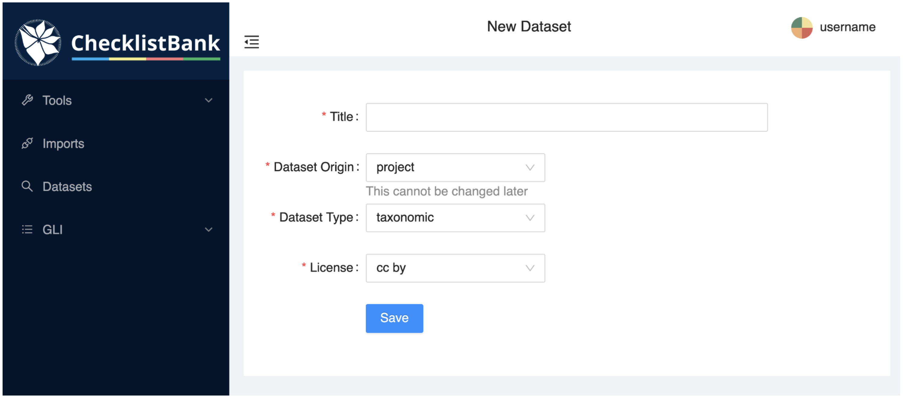

[multipage-level=1]
== Creating a new project

Go to Datasets on  the menu on the left side of the ChecklistBank window, and then click on ‘+New Dataset’. 

Complete the form:

* Set a meaningful and clear title. For this tutorial use: your name followed by "Moths of the World".
* Select "project" for the Dataset Origin and "taxonomic" for the Dataset Type. 
* Set a Creative Commons licence for the project: “cc by” is appropriate since none of the four source datasets of this tutorial have more restrictive licences. It is important to consider that the licences of the source datasets must be compatible, that is, if the base source has a less restrictive licence, it will not be possible to integrate information from a more restrictive source. The licence of the project can be changed at any time. 
* Click 'Save'. 

