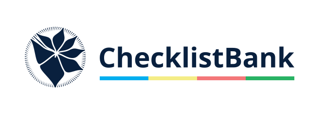

= ChecklistBank Project: A tool to build and curate checklists
Catalogue of Life <support@catalogueoflife.org>
GBIF Secretariat <training@gbif.org>
:multipage:
:multipage-level: 1
:toc: left
:toclevels: 3
:numbered:
:revnumber: {git-metadata-sha-short}
:revdate: {git-metadata-date} {git-metadata-time} {git-metadata-timezone}
:title-page-background-image: image::img/logos/clb-col-dark.svg[position=top center]
:license: https://creativecommons.org/licenses/by-sa/4.0/
:docinfo: shared-head
// :stylesheet: /adoc/gbif-stylesheet/stylesheets/gbif-training.css

ifndef::backend-pdf[]
languageLinks:combined[]
endif::backend-pdf[]

// add cover image to img directory and update filename below
ifndef::backend-pdf[]
:figure-caption!:

endif::backend-pdf[]

:sectnums!:

include::description.en.adoc[]

include::login.en.adoc[]

include::usecase.en.adoc[]

include::creatingaproject.en.adoc[]

include::metadata.en.adoc[]

include::checklistassembly.en.adoc[]

include::colophon.en.adoc[]
:sectnums!:

