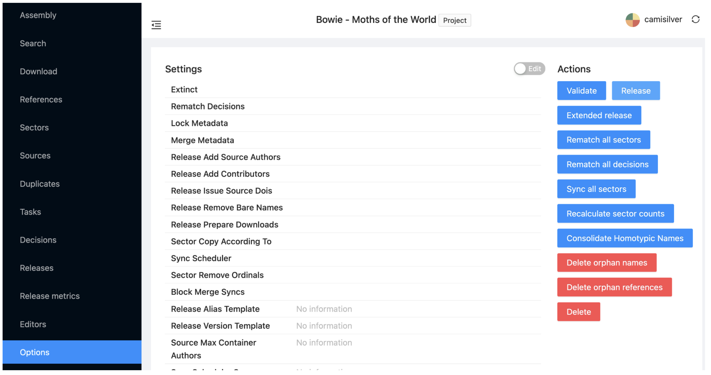
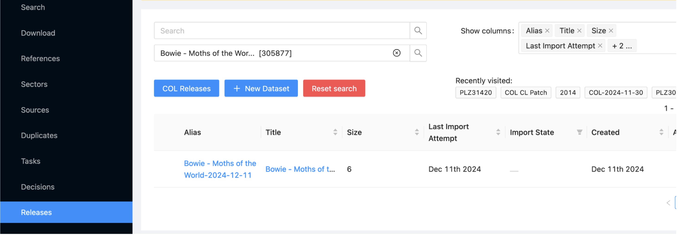
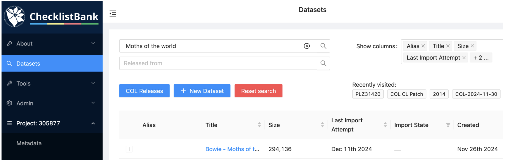
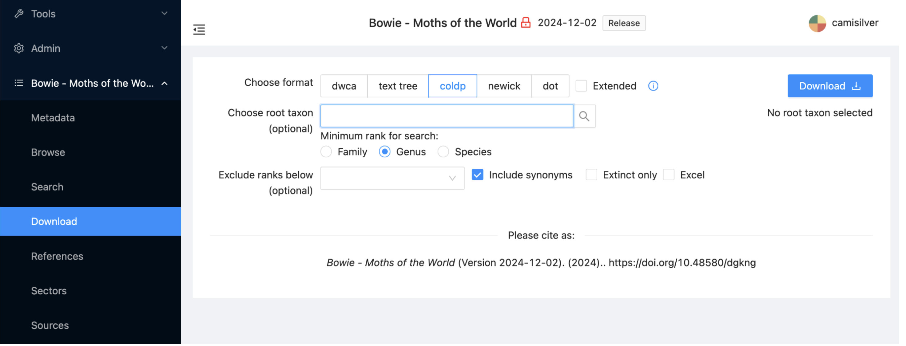
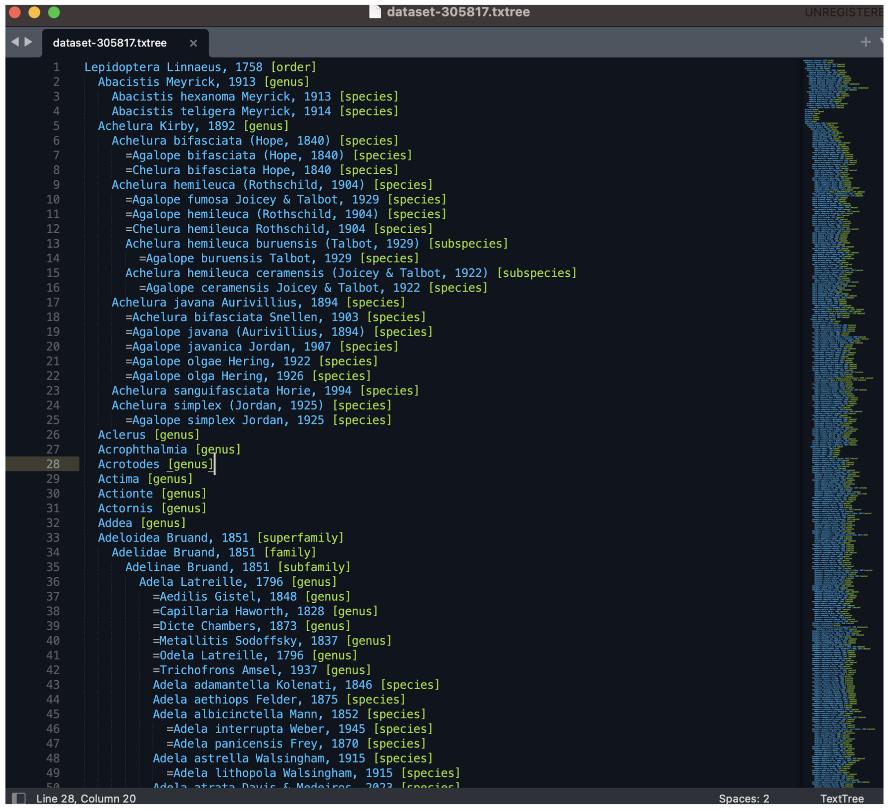

== Release

To create a dataset that is a static snapshot of the assembly, you will need to make a ‘Release’. This will also generate stable identifiers for each taxon. The dataset generated will have the same characteristics and metadata as the project and will be available in the platform as public or private (depending on the definition of the project). 

Go to the  Options item on the left menu, and the Click on Release, the second action at the right. According to the project size it can take several minutes up to hours for the Release to be read.

Releases are listed in the Releases view.  

== Download

Return to the main Datasets subitem on the left and search for your dataset. Once releases have been completed, you will find both the project dataset and its releases in the search results. Either can be selected for the following steps, although (as noted above) only the released versions will have stable identifiers if you plan to reference taxa by URI.

Select the Download subitem. This allows the dataset to be downloaded in a variety of formats:

- The coldp (Catalogue of Life Data Package) format is a rich data model that includes the most complete view of the contents of each dataset (see the https://www.google.com/url?q=https://github.com/CatalogueOfLife/coldp&sa=D&source=docs&ust=1733781423575681&usg=AOvVaw35RSjdeZVnv0hPcQZgeXVu[CoLDP specification]).

- The text tree format is a simple text view of the names, classification and synonyms. You will download this for your project dataset. 

For this excercise apply any desired filters then select "text tree" and click on 'Download'. The resulting ZIP file contains the metadata (as a YAML file) and the tree representation of the dataset (as a TXT file). 

The view shown includes the merged genus Gargela.  
